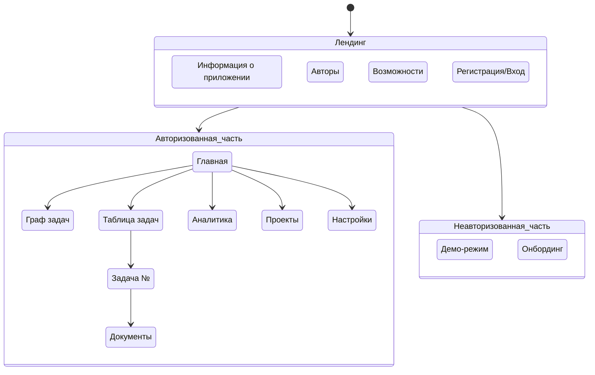

# План страниц и требования

---

#### План страниц (дополненная схема)


---

### Описание страниц

#### Лендинг (неавторизованные пользователи)
1. **Информация о приложении**
   - Назначение: Описание ключевых возможностей, скриншоты интерфейса.
   - Переходы: Кнопки "Попробовать демо", "Регистрация".
2. **Авторы**
   - Назначение: Информация о разработчиках, контакты.
3. **Возможности**
   - Назначение: Сравнение тарифов (Free/Premium), список функций.
4. **Регистрация/Вход**
   - Назначение: Формы аутентификации через email/соцсети.

#### **Неавторизованная часть**
5. **Демо-режим**
   - Назначение: Интерактивный пример с предзагруженными задачами.
   - Ограничения: Данные не сохраняются.
6. **Онбординг**
   - Назначение: Пошаговый гайд по основным функциям после регистрации.

#### **Авторизованная часть**
7. **Главная**
   - Назначение: Центральный хаб с краткими виджетами (ближайшие задачи, статистика).
   - План на день.
8. **Граф задач**
   - Назначение: Визуализация зависимостей между задачами (ноды = задачи, связи = блокировки).
9. **Таблица задач**
   - Назначение: Список задач с фильтрами (проект, тег, статус).
10. **Задача №**
    - Назначение: Детали задачи (описание, подзадачи, комментарии, вложения).
11. **Аналитика**
    - Назначение: Графики продуктивности, отчеты за период.
12. **Проекты**
    - Назначение: Управление групповыми проектами (участники, роли).
13. **Настройки**
    - Назначение: Профиль, уведомления, тема оформления.
14. **Документы**
    - Назначение: Просмотр прикрепленных файлов (PDF, изображения).

---

### Требования к страницам

#### Общие требования
- **Адаптивность:** Поддержка мобильных/планшетных экранов.
- **Производительность:** Загрузка контента ≤ 1 сек.
- **Навигация:** Единая панель навигации в Auth-части.

#### Специфические требования
1. **Таблица задач:**
   - Фильтры: по проекту, тегу, статусу (активные/завершенные).
   - Сортировка: по дате создания, дедлайну, приоритету.
   - Группировка: по проектам/категориям.
   ```mermaid
   graph LR
   A[Таблица] --> B(Фильтр по проекту)
   A --> C(Сортировка по дате)
   A --> D(Поиск по названию)
   ```

2. **Граф задач:**
   - Автоматическая расстановка узлов (алгоритм ForceAtlas2).
   - Цветовая кодировка:
     - 🔴 Просроченные
     - 🟢 Выполненные
     - 🔵 Активные
   - Клик по узлу → переход на страницу задачи.

3. **Страница задачи:**
   - Обязательные поля:
     - Название (макс. 100 символов)
     - Дедлайн (календарь + время)
     - Приоритет (низкий/средний/высокий)
   - Дополнительно:
     - Чек-лист подзадач
     - Комментарии с @упоминаниями
     - Прикрепление файлов (до 5 МБ)

4. **Аналитика:**
   - Виджеты:
     - Прогресс за неделю (линейный график)
     - Распределение задач по проектам (круговая диаграмма)
     - Топ-5 самых долгих задач
   - Экспорт в CSV (Premium).

5. **Демо-режим:**
   - Предзагруженные сценарии:
     - Личные задачи (5 шт.)
     - Рабочий проект (3 задачи + 2 участника)
   - Блокировка сохранения данных.

---
